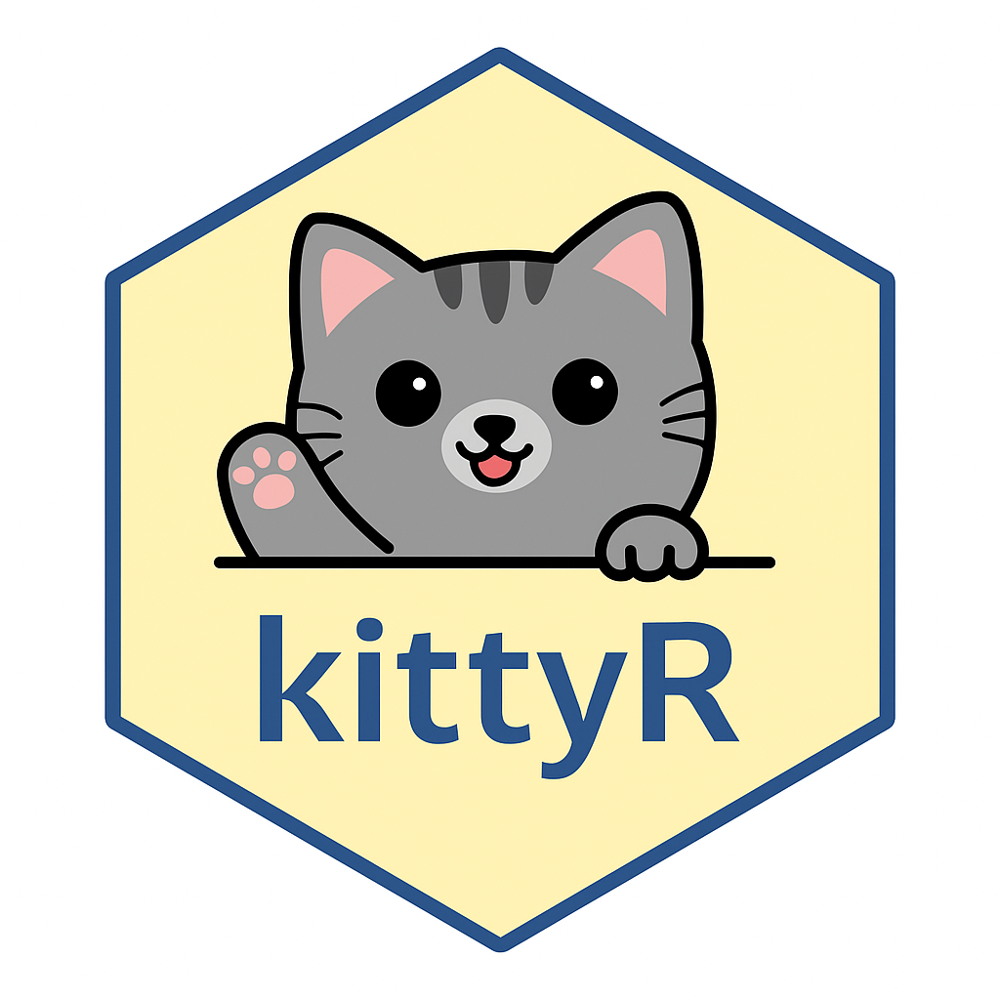

<!-- README.md is generated from README.Rmd. Please edit that file -->

# KittyR 🐱 

<!-- badges: start -->
<!-- badges: end -->

kittyR is my very first R package; simple, fun, and completely
unnecessary. It shows silly ASCII cats in your console, and I made it
just to make people smile (myself included 😄).

## Why I Made This

I was inspired by [Fonti Kar](https://github.com/fontikar/ohwhaley) and
her charming owhaley package; a package that prints whales instead of
doing anything “serious.”

I saw her talk at the [Wombat Workshop
2024](https://github.com/fontikar/silly-wombat/blob/main/slides.pdf),
where she shared how joy, silliness, and weird ideas can live
beautifully in open source. It made me realize that package development
doesn’t have to start with solving the world; it can start with
something playful.

And since I really love cats; their elegance, weirdness, independence; I
knew cats had to be the theme of my first R package.

So kittyR was born: a colorful little space where cats can live in your
console.

## Installation

You can install the development version of kittyR from
[GitHub](https://github.com/) with:

``` r
# install.packages("devtools")
devtools::install_github("Tinarj/kittyR")
```

## Example

``` r
library(kittyR)

# Default cat
kitty()
#> 
#>          /\__/\
#>         /`    '\
#>       === 0  0 ===
#>         \  --  /
#>        /        \
#>       /          \
#>      |            |
#>       \  ||  ||  /
#>        \_oo__oo_/#######o
#> 
```

## What’s Next?

I’m just starting out with:

R package development

Contributing to open source

Data science in public

So this is the first pawprint on the path 🐾 Thanks for stopping by, and
if you smile even a little from this, I consider it a win.
